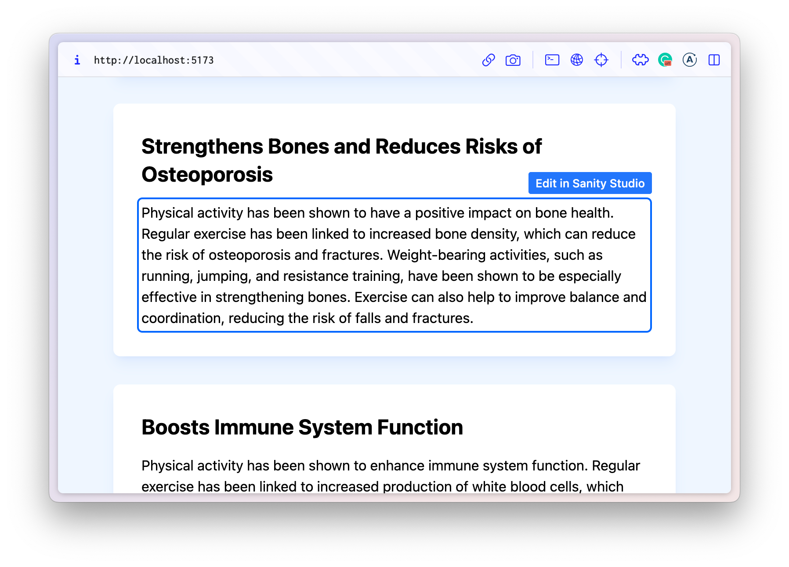

# Sanity, GraphQL and Content Source Maps

An example React application using:

- Vite, React, TypeScript and Tailwind CSS
- [Sanity content queried via GraphQL](https://www.sanity.io/docs/graphql)
- GraphQL queries using Apollo Client
- [Content Source Maps returned in the GraphQL](https://www.sanity.io/docs/graphql#e52e2285f14f) responses' [`extensions`](https://www.apollographql.com/docs/resources/graphql-glossary/#extensions) object
- [@sanity/preview-kit/csm transcoder](https://github.com/sanity-io/preview-kit#sanitypreview-kitcsm) to apply encoding from [@vercel/stega](https://www.npmjs.com/package/@vercel/stega) from Content Source Maps into Sanity content using [Apollo Client's `link`](https://www.apollographql.com/docs/react/networking/advanced-http-networking/#modifying-response-data) parameter.
- [@sanity/overlays](https://github.com/sanity-io/overlays) to provide clickable links to content
